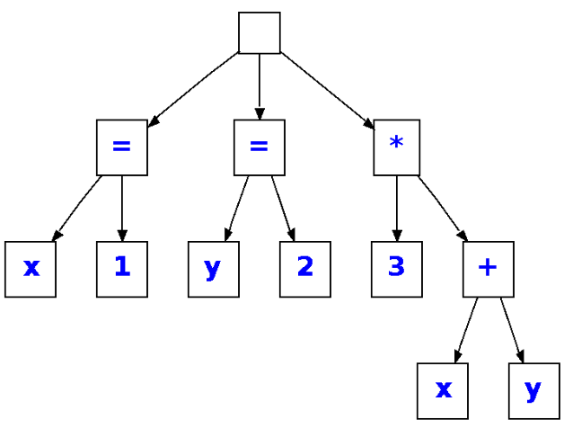

# Compilador de Lenguaje tipo Calculadora

  

## Descripción del Proyecto
Este proyecto consiste en el diseño e implementación de un sistema completo de compilación, abarcando desde el análisis léxico hasta la ejecución del código generado. El compilador reconoce un lenguaje de programación diseñado para funcionar como una calculadora avanzada, capaz de evaluar expresiones, manejar variables y ejecutar estructuras de control.

## Herramientas y Tecnologías
El compilador ha sido desarrollado utilizando las siguientes herramientas:
*   **Java**: Lenguaje principal de desarrollo.
*   **ANTLR**: Utilizado a través del plugin de ``IntelliJ`` para la generación automática de los analizadores léxico y sintáctico.
*   **Jasmin**: Lenguaje ensamblador utilizado para la generación e interpretación del código intermedio dirigido a la Máquina Virtual de Java (``JVM``).
*   **Eclipse IDE**: Entorno utilizado para la elaboración del programa principal y la clase `MiVisitor`.

## Fases del Compilador

### 1. Analizador Léxico
Divide el código fuente en tokens o unidades mínimas de información mediante un archivo `.g4` procesado por ``ANTLR``.
*   Identifica palabras reservadas, identificadores, números (enteros y decimales), operadores y signos de puntuación.
*   Se encarga de ignorar los espacios en blanco y los saltos de línea.

### 2. Analizador Sintáctico (Parser)
Implementa un analizador ascendente (``bottom-up``) de tipo ``LL(*)``.
*   Procesa el código de izquierda a derecha verificando que la secuencia de tokens cumpla las producciones de la gramática.
*   Construye un Árbol de Sintaxis Abstracta (``AST``) de forma jerárquica mediante bloques, gestionando la precedencia explícita de operadores (ej. multiplicación sobre suma).

### 3. Analizador Semántico
Asegura la validez y coherencia lógica de las instrucciones estructuradas en el ``AST``.
*   **Tabla de Símbolos (TDS):** Se implementa mediante una tabla de dispersión (`HashMap`) que asocia el identificador de cada variable con su dirección de memoria.
*   Cada variable de tipo numérico (`double`) reserva dos posiciones contiguas de memoria.
*   Comprueba que todas las variables y funciones sean declaradas antes de su uso; de lo contrario, lanza una excepción.
*   El ámbito de las funciones y variables es global y permite la recursividad.

### 4. Generación de Código Intermedio
Traduce el ``AST`` a código intermedio utilizando instrucciones del lenguaje ``Jasmin``, que la ``JVM`` puede interpretar.
*   **Operaciones:** Genera instrucciones bytecode como `dload`, `dstore`, `dadd`, `dmul`, `ifeq`, `goto`, entre otras.
*   Los números son tratados por defecto como formato `double` para unificar las operaciones.
*   Emplea instrucciones especiales como `invokestatic` para llamadas a funciones matemáticas predefinidas (`Math.sqrt`, `Math.pow`) o funciones de usuario.

## Características del Lenguaje y Mejoras
El lenguaje incluye sentencias terminadas en `;`, soporte para asignaciones (`=`), y operadores aritméticos (`+`, `-`, `*`, `/`, `%`, `SQRT`, `^`) y lógicos (`<`, `>`, `=`).

**Estructuras Base:**
*   Bloques de código: `Begin <...> End;` 
*   Condicionales: `If (condición) Then <...> [Else <...>] EndIf;` 
*   Bucles: `While (condición) <...> EndWhile;` 
*   Funciones: `Func nombre(args) <...> End Func;` y `Return <...>;` 
*   Impresión en consola: `Print <...>;` 
*   **Bucle FOR:** Estructura `FOR variable = inicio TO fin DO Begin <...> End;` con auto-incremento de +1 en cada ciclo.
*   **Comentarios:** Token `//` en el analizador léxico para permitir comentarios de una línea, los cuales son ignorados durante la compilación.

  

